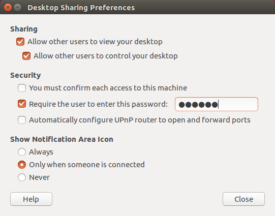

### 安裝指南

# 準備

* 兩台PC(ubuntu16.04+window8.1)
* 一台TX2
* 一台螢幕支援hdmi
* 一台自動DHCP分享器
* 兩條網路線(TX2、主機需要同一個網域底下)


# 步驟一

下載jetpack到主機(ubuntu16.04)
https://developer.nvidia.com/embedded/downloads

apt更新
```
sudo apt update
sudo apt grade
```

# 步驟二

```
# 先在主機安裝sdk manager
cd Dowloads
ls ./sdk...(tab)
sudo apt install ./skdmanager...(tab)
# run
skdmanager
```

# 步驟三

登入後

a. 選擇 tx2就好 主機(HOST)不用

b. 打勾,同意

c. 等待安裝,flash(~ Insatalling... 50%)

  c1. 過程如果跳出視窗需要(manual)手動重置tx2
  
  c2. 長按power強制關機tx2,拔電源線,重新接上開機,按recovery兩秒接著按reset放開後,等兩秒再放開recovery
  
  c3. `lsusb`查看是否usb有抓到`Nvidia Cropertion`==tx2板子
  
d. 主機:用其他電腦VNC遠端控制主機(只有一個螢幕的方法)

螢幕接TX2(這時候已經安裝好TX2的OS了，會有畫面)

tx2:設定帳號密碼等等...結束後

登入TX2`ifconfig -e`查TX2虛擬IP(待會要在主機那邊登入TX2，以便安裝SDK檔案)

取得ip後到主機這邊輸入ip及帳密，開始安裝SDK

註：主機有安裝opencv會衝突，導致TX2安裝過程computer vision會Error

# 步驟四

在TX2設定VNC 的 server, nvidia官方用`vino`

# 安裝常用套件
`sudo apt install ssh vino`

# 設定VNC 桌面遠端(desktop sharing) -> 
  * 預設為disable所以需要再設定
      ```
      export DISPLAY=:0
      gsettings set org.gnome.Vino enabled true
      gsettings set org.gnome.Vino prompt-enabled false
      gsettings set org.gnome.Vino require-encryption false
      /usr/lib/vino/vino-server
      
      # 沒辦法work?錯誤？
      ps aux | grep X
      DISPLAY=:1 /usr/lib/vino/vino-server
      
      # 錯誤？ Vino' does not contain a key named 'enable'?
      sudo vi /usr/share/glib-2.0/schemas/org.gnome.Vino.gschema.xml
      
      # 編輯 
      sudo nano /usr/share/glib-2.0/schemas/org.gnome.Vino.gschema.xml
      
      # 在key那層插入
      <key name='enabled' type='b'>
         <summary>Enable remote access to the desktop</summary>
         <description>
         If true, allows remote access to the desktop via the RFB
         protocol. Users on remote machines may then connect to the
         desktop using a VNC viewer.
         </description>
         <default>false</default>
      </key>
      ```
      
   * 左上搜尋 desktop sharing
   
      
      

# 再試一試
      export DISPLAY=:1
      gsettings set org.gnome.Vino enabled true
      gsettings set org.gnome.Vino prompt-enabled false
      gsettings set org.gnome.Vino require-encryption false
      /usr/lib/vino/vino-server
      
# 完成

# 安裝tensorflow-gpu(aarch64)
      sudo apt install python3-pip 
      sudo apt install libhdf5-serial-dev hdf5-tools
      pip3 install --extra-index-url https://developer.download.nvidia.com/compute/redist/jp/v42 tensorflow-gpu==1.13.1+nv19.X --user

